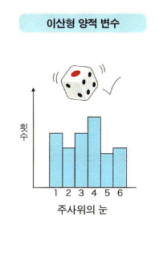
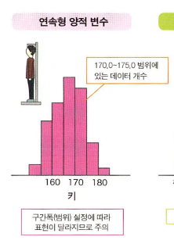

# 통계학 2주차 정규과제

📌통계학 정규과제는 매주 정해진 분량의 『*빅데이터 시대, 올바른 인사이트를 위한 통계 101×데이터 분석*』 을 읽고 학습하는 것입니다. 이번 주는 아래의 **Statistics_2nd_TIL**에 나열된 분량을 읽고 `학습 목표`에 맞게 공부하시면 됩니다.

아래의 문제를 풀어보며 학습 내용을 점검하세요. 문제를 해결하는 과정에서 개념을 스스로 정리하고, 필요한 경우 추가자료와 교재를 다시 참고하여 보완하는 것이 좋습니다.


## Statistics_2nd_TIL

### 3장 통계분석의 기초
#### 01. 데이터 유형
#### 02. 데이터 분포
#### 03. 통계량 
#### 04. 확률
#### 05. 이론적인 확률분포
### 4장 추론통계~신뢰구간 
#### 01. 추론통계를 배우기 전에
#### 02. 표본오차와 신뢰구간


## Study Schedule

| 주차  | 공부 범위     | 완료 여부 |
| ----- | ------------- | --------- |
| 1주차 | p.16~45    | ✅         |
| 2주차 | p.48~115   | ✅         |
| 3주차 | p.118~173  | 🍽️         |
| 4주차 | p.176~220 | 🍽️         |
| 5주차 | p.221~287 | 🍽️         |
| 6주차 | p.290~334 | 🍽️         |
| 7주차 | p.338~394 | 🍽️         |

<br>

<!-- 여기까진 그대로 둬 주세요-->


# 1️⃣ 개념 정리 
## 01. 데이터 유형

```
✅ 학습 목표 :
* 기초적인 통계 용어에 대해 설명할 수 있다.
* 데이터 유형에 대해 이해한다.
```
#변수 : 데이터 중 공통의 측정 방법으로 얻은 같은 성질의 값. 
Ex.키 
-데이터에 ‘키’ 만이 포함되어 있는 경우 1변수 데이터라고 함. 키와 몸무게 2가지를 측정한 데이터라면 2변수 데이터임. 

-변수의 개수는 ‘차원’ 이라 표현되기도 함. 

데이터를 수집할 때나 분석을 실행할 때는 변수가 어떤 유형인지 주의 깊게 고려하는 것이 중요함. 

변수는 양적 변수와 질적 변수 2가지로 나눌 수 있음. 

#양적변수(수치형 변수)
숫자로 나타 낼 수 있는 변수. 
숫자이므로 대소 관계가 있으며 평균값처럼 양을 계산할 수 있음. 
양적변수는 다시 이산형과 연속형으로 나눌 수 있음. 

-이산형
얻을 수 있는 값이 점점이 있는 변수를 이산형 양적 변수(이산변수)라 함. 
Ex. 주사위 눈은 나오는 값이 1부터 6까지의 정수이므로 이산형 양적변수임. 
그 밖에 횟수나 사람 수 같이 셀 수 있는 숫자 데이터도 이산형 양적변수임. 

-연속형
키 173.4나 몸무게 65.8같이 간격 없이 이어지는 값으로 나타낼 수 있는 변수를 연속형 양적 변수(연속변수)라 함. 정밀도가 높은 측정 방법을 이용하면, 원리상으로는 소수점 아래 몇 자리든 나타낼 수 있다는 점에서 이산형과는 다름. 

#질적 변수(범주형 변수)
숫자가 아닌 범주로 변수를 나타낼 때, 이를 질적 변수 또는 범주형 변수라고 한다. 
Ex. 설문조사의 예/ 아니오, 동전의 앞/뒤, 맑음/흐림, 눈/비 등과 같은 날씨, 식당 메뉴 등

양적 변수와 달리 변수 사이에 대소 관계가 없고, 숫자가 아니므로 평균값 등의 수치 역시 정의 할 수 없다. 


## 02. 데이터 분포

```
✅ 학습 목표 :
* 변수 유형에 따라 히스토그램 정의를 설명할 수 있다.
```

데이터가 어떻게 분포되어 있는지를 그래프 등으로 시각화하여 대략적인 데이터 경향을 파악하는 것이 데이터 분석의 첫 단계이다. 

데이터 분포를 그림으로 나타내는 데는 어떤 값이 데이터에 몇 개 포함되어 있는가를 나타내는 그래프인 <도수분포도(히스토그램)>를 자주 사용한다. 

-이산형 양적 변수의 히스토그램


가로축은 숫자, 세로축은 데이터에 나타난 개수를 표시한다. 


-연속형 양적 변수의 히스토그램 
 

변수가 연속형 양적 변수인 경우, 소수점 이하 자리가 얼마든지 지속되기 때문에 엄밀하게 같은 값은 존재하지 않는다. 그러므로 범위를 설정하고, 그 범위에 포함되는 숫자 개수를 세어 이를 세로축에 둔다. 
이 범위의 넓이를 ‘구간폭’ 이라고 부른다. 

-범주형 변수의 히스토그램
 

범주형 변수라면 가로축에는 각 범주를, 세로축에는 각 범주에 속하는 개수를 나타낸다. 범주형 변수의 값에는 대소 관계가 없으므로, 가로축 순서에 특별한 뜻은 없다. 


## 03. 통계량
```
✅ 학습 목표 :
* 통계량의 개념과 역할을 이해한다.
* 대푯값의 종류와 각 대푯값의 특성을 설명할 수 있다.
* 자료의 산포를 나타내는 분산과 표준편차의 의미를 이해한다.
* 이상값(이상치)의 개념과 통계 분석에서의 영향을 이해한다.
```
#통계량: 수집한 데이터로 이런저런 계산을 수행하여 얻은 값. 
다양한 통계량 계산을 통해 대상을 이해하는 과정을 데이터 분석이라 할 수 있음. 
기술통계량/ 요약통계량: 데이터 그 자체의 성질을 기술하고 요약하는 통계량.

#다양한 기술통계량
대략적인 분포 위치를 나타냄 : 평균값, 중앙값, 최빈값 
데이터 퍼짐 정도를 나타냄: 분산, 표준편차

#대푯값
분포가 어느 부근에 있는지. 대략적인 분포 위치, 즉 대표적인 값을 정량화하기 위해 사용하는 통계량을 대푯값이라고 함. 

-평균값
-중앙값: 크기 순으로 값을 정렬했을 때 한가운데 위치한 값. 
-최빈값: 데이터 중 가장 자주 나타나는 값

분포가 좌우대칭에 가까운 봉우리 형태라면 평균값, 중앙값, 최빈값은 대체로 일치하며 좌우 비대칭 분포라면 그림과 같이 각각 다른 값이 되는 경향이 있다. 
(평균값은 계산 시 모든 값을 고려하기 때문에 이상값의 영향을 받기 쉽다는 특징이 있다. 그러나 중앙값은 상대적인 크기로부터 구해지며, 가운데에 있는 값만 참조하므로 이상값에는 잘 영향받지 않는다.)

#히스토그램의 중요성 
극단적인 쌍봉형 사례가 나타날 수 있으므로, 처음부터 히스토그램을 그려 대략적인 파악을 한 다음, 대푯값으로 적절하게 분포를 특징 지을 수 있는지 확인하는 것이 중요함. 

#분산과 표준편차
대푯값을 이용하면 데이터가 ‘어디를 중심으로 분포하는지’라는 정보를 얻을 수 있다. 그럼 다음으로 분포 형태를 평가해보면 분포의 폭, 데이터가 ‘어느정도 퍼져 있는지(흩어져 있는지)’를 파악하는 것이 중요하다. 
데이터 퍼짐을 평가하기 위해서는 분산 또는 표준편차라는 통계량을 계산한다. 표본을 평가한다는 점을 강조하여 ‘표본분산’ 이나 ‘표본표준편차’ 라 부르기도 한다. 

-표본분산
표본의 각 값과 표본 평균이 어느정도 떨어져 있는지를 평가하는 것으로 데이터 퍼짐 상태를 정량화한 통계량이다. 표본분산은 각 값과 평균값의 차이를 제곱한 것을 모두 더한 다음, 표본크기 n으로 나눈다. 이렇게 각 밧과 평균값 사이 거리의 제곱을 평균화한 값으로써 데이터 퍼짐 정도를 평가한다. 
표본분산의 성질
모든값이 같다면 0 / 데이터 퍼짐 정도가 크면 표본분산도 커짐. 

-표본표준편차
표본분산의 제곱근을 취한 것. 계산상 분산과 표준편차에는 제곱근인지 아닌지의 차이만 있으며, 포함하는 정보에는 차이가 없다. 데이터 퍼짐 정도를 정량화한 지표로는 표준편차 쪽이 감각적으로 더 알기 쉽다. 

#상자 수염 그림 (box-and-whisker)
데이터가 어떤 분포인지 나타낼 때 자주 사용되는 그래프이다. 
-제1사분위수: 큰 쪽부터 세었을 때 1/4 위치에 있는 값
-제3사분위수: 작은 쪽부터 세었을 때 1/4 위치에 있는 값.
-제2사분위수=중앙값: 상위 절반 또는 하위 절반 위치를 가리키는 값. 

제1사분위수부터 제3사분위수까지의 범위가 상자이다. 
수염은 상자 길이의 1.5배 길이를 상자로부터 늘인 범위 안에서, 최대값 또는 최솟값을 가리킨다. 
이 범위에 포함되지 않은 값은 이상값으로 정의된다. 
#분포를 시각화 하는 다양한 방법. 

-오차막대 
평균값을 막대그래프의 높이로 나타내고, 표준편차를 평균값에서 아래위로 늘림. 표준편차라는 2가지 통계량을 시각화 한 것. 상자 수염 그림이랑 마찬가지로 분포 형태까지는 자세하게 알 수 없다. 
 
-바이올린 플롯
히스토그램을 부드럽게 표현한 그래프, 어디쯤 데이터가 존재하기 쉬운지를 추정하여 이를 나타냄. 

-스웜플롯
값이 겹치지 않도록 점을 찍음으로써, 각 데이터가 어디에 있는지를 자세하게 나타내는 방법. 이 그림에는 평균값이나 중앙값 등의 통계량은 표시되지 않지만, 분포형태나 자세한 데이터 위치 정보는 시각화 되어 있음. 따라서 상자 수염 그림 등을 함께 그려 정보를 보완하는 것도 가능함. 

#이상값
이상값의 명확한 정의는 없으나, 평균값에서 표준편차의 2배 또는 3배 이상 벗어난 숫자임. 


## 04. 확률

```
✅ 학습 목표 :
* 확률의 기본 개념과 확률변수 및 확률분포의 의미를 이해한다.
* 추론통계에서 사용되는 확률분포의 개념을 이해한다.
* 사건 간 독립의 개념과 통계적 의미를 이해한다.
```

확률: 불확실한 사건의 발생 가능성을 숫자로 표현한 것. 
-확률변수: 확률이 달라지는 변수
-실현값: 확률변수가 실제로 취하는 값

#확률분포 
확률분포란 가로축에 확률변수를 세로축에 그 확률변수의 발생 가능성을 표시한 분포이다. 확률변수가 이산형인 경우 세로축이 확률 그 자체를 나타낸다.

#확률 밀도 함수 (확률변수가 연속형일 때)
실수면 소수점 이하 자리가 무한히 계속될 수 있으므로, 확률변수가 하나의 값일 확률은 0이된다. 따라서 연속형 확률변수의 경우에는 값에 일정한 범위를 두고 확률을 구한다. 그 확률을 계산하는 함수를 확률밀도함수라고 한다. 확률밀도함수의 세로축은 확률 그 자체의 값이 아니라 상대적인 발생가능성을 표현한 값이다. 

#기댓값
(양적 확률변수라면, 확률분포를 특징 짓는 양을 계산할 수 있다.) 기댓값은 변수가 확률적으로 얼마나 발생하기 쉬운가를 평균적인 값으로 나타낸 것이다. 

#분산과 표준편차
확률분포가 기댓값 주변에 어느정도 퍼졌는지를 나타내는 값은 통계량 계산에서도 등장한 분산으로, V(x)로 표기한다. 
성질
-0이상일 것
-모두 같은 값이 나타나는 경우에는 0
-기댓값에서 떨어진 값이 많을수록 커짐. 

#왜도
분포가 좌우대칭에서 어느 정도 벗어났는지로 평가한다. 

#첨도
분포가 얼마나 뽀족한지와 그래프의 꼬리가 차지하는 비율이 얼마인지로 평가한다. 

#동시확률분포 
확률변수 2개를 동시에 생각할 때의 확률분포를 동시확률분포라고 한다. 

#파라미터(모수)
이론적인 확률분포는 수식으로 표현되며 분포의 형태를 정하는 숫자인 파라미터를 가진다. 
그러므로 파라미터를 알면 확률분포의 형태를 알 수 있다. 
-데이터 분석의 목적은 모집단의 성질을 아는 것이었음, 
-모집단을 '00이라는 파라미터를 가진 @@이라는 확률분포'로 나타낼 수 있다면, 모집단의 성질을 아는 것이 되므로 데이터 분석의 목적 그 자첵 됨. 


## 05. 이론적인 확률분포

```
✅ 학습 목표 :
* 모수의 개념과 통계적 의미를 이해한다.
* 정규분포의 특성과 표준화의 개념을 설명할 수 있다.
```

#정규분포 (가우스 분포)
(확률밀도함수로 나타낸 것)
확률분포는 평균과 표준편차라는 2개의 파라미터로 정해진다. 
정규분포는 N(평균, 표준편차제곱)으로 표기하는데, 특히 평균이 0 표준편차 1인 정규분포 N(0,1)을 표준정규분포라 한다. 평균은 분포의 위치를, 표준편차는 분포의 넓이를 결정한다는 것을 알 수 있다. 

#정규분포의 특징
-평균을 중심으로 한 종형으로, 좌우대칭 분포이다. 
-평균 근처에 값이 가장 많고, 평균에서 멀어질수록 적어진다.
-키나 몸무게 등 정규분포로 근사할 수 있는 현상이 많다. 

#표준화
일반적으로 확률변수 X 또는 데이터의 평균과 표준편차를 이용하여 다음과 같이 계산하면 평균 0, 표준편차 1로 변환할 수 있다. 
Z= x-μ / σ 
이를 표준화라 하며, 변환된 새로운 값을 Z값 이라 부르기도 한다. 평균과의 거리가 표준편차의 몇 배인가를 나타내기 때문에 본래의 평균이나 표준편차와 상관없이 분포 안에서 어디에 위치하는가를 알 수 있다. 


## 06. 추론통계를 배우기 전에

```
✅ 학습 목표 :
* '데이터를 얻는다는 것'의 의미를 이해한다.
* 무작위추출의 개념과 통계적 필요성을 설명할 수 있다.
* 추론통계의 직관적 의미를 이해한다
```

모집단=확률분포
표본=확률분포를 따르는 실현값
얻은 표본으로 모집단을 추정한다 
--> 얻은 실현값으로 이 값을 발생시킨 확률분포를 추정한다. 

-무작위 추출
모집단에서 표본을 얻을 때 중요한 것. 이는 데이터를 얻을 때 모집단에 포함된 요소를 하나씩 무작위로 선택하여 추출하는 방식. (데이터의 실현값은 확률분포에서 무작위로 발생하도록 한 값이라고 생각해야 하기 때문) 

-모집단에 대해 추정한 결과를 어느정도 일반화 할 수 있는가는 각 분야 고유의 지식에 따라 달라짐. 

-정말로 알고자 하는 것은 표본 데이터가 아니라 모집단이다. 

-모집단의 모든 요소를 다 조사하는 전수조사는 어렵다. 

-작은 크기의 표본으로도 모집단을 추론할 수 있다. 

-표본을 추출할 때는 무작위로 추출해야한다. 


## 07. 표본오차와 신뢰구간

```
✅ 학습 목표 :
* 표본오차의 개념을 이해한다.
* 중심극한정리의 기본 개념과 역할을 이해한다.
* 신뢰구간의 의미와 활용 방법을 이해한다.
```

#표본오차
정말로 알고 싶은 것과 실제로 손안에 있는 데이터의 어긋남. ( 인위적인 실수나 잘못으로 생기는 오차가 아니라, 데이터 퍼짐이 있는 모집단에서 확률적으로 무작위 표본을 고르는 데서 발생하는, 피할 수 없는 오차임.) 표본오차는 평균값에 국한 되지 않으며, 모집단의 다양한 성질에 대해서 일반적으로 발생하는 것임. 
-표본은 모집단의 성질과 정확히 일치하지 않고, 확률오차를 수반한다. 

#큰 수의 법칙
표본크기 n이 커질수록 표본평균이 모집단 평균에 한없이 가까워진다는 법칙

#중심극한정리 
(표본오차의 분포에 관해 중요한 정보를 제공하는 것)
이는 모집단이 어떤 분포이든 간에 표본크기 n이 커질수록 표본평균의 분포는 정규분포로 근사할 수 있다는 것을 의미함. 

#추정량
모집단의 성질을 추정하는 데 사용하는 통계량
-일치추정량
표본크기를 무한대로 했을 때, 모집단의 성질과 일치하는 추정량
-비편향추정량
추정량의 평균값이 모집단의 성질과 일치할 때의 추정량
-비편향추정량은 매번 얻을 때마다 확률적으로 다르값이 되지만, 평균으로 보면 모집단의 성질을 과대하지도 과소하지도 않게 나타내는 양을 뜻한다. 

#신뢰구간
표본에서 구한 모집단이 추정값을 어느 정도 신뢰할 수 있는지를 나타내는 것. 

#t분포와 
t분포는 모집단이 정규분포라는 가정하에 미지의 모집단 표준편차σ 를 표본으로 계산한 비편향표준편차로 대용했을 때,  표본평균- μ 를 표준오차로 나누어 표준화한 값이 따르는 분포. 


<br>
<br>

# 2️⃣ 확인 문제

## 문제 1.

> **🧚Q. 한 기업이 신제품 출시 후 “소비자 전반의 만족도”를 파악하고자 한다.
이를 위해 전체 소비자 중 일부를 무작위로 선택해 설문을 실시했고, 평균 만족도가 높게 나타났다.
그러나 내부 회의에서 다음과 같은 의견이 나왔다.

“설문 결과가 좋으니, 우리 제품은 소비자 전체에게도 만족도가 높다고 결론 내려도 되지 않을까?”
> **이 결론의 타당성을 판단하기 위해 통계학적으로 가장 적절한 설명은 무엇인가?**

~~~
1️⃣ 일부 소비자를 조사했으므로 이는 전수조사이며, 결과는 그대로 신뢰할 수 있다.
2️⃣ 표본의 평균이 높게 나타났다면, 모집단의 평균도 반드시 높다고 볼 수 있다.
3️⃣ 표본이 모집단을 적절히 대표한다면, 표본 결과를 통해 모집단의 특성을 추론할 수 있다.
4️⃣ 데이터 분석의 목적은 결과를 빠르게 도출하는 것이므로 표본의 대표성은 중요하지 않다.
~~~


<!--학습한 개념을 활용하여 자유롭게 설명해 보세요.-->

```
3번
:통계에서는 전체 집단(모집단)을 모두 조사하기 어렵기 때문에 일부를 선택한 표본을 통해 모집단의 특성을 추론한다. 하지만 이때 중요한 조건은 표본이 모집단을 잘 대표해야 한다는 것(대표성)이다. 무작위로 적절하게 추출된 표본이라면 그 결과를 바탕으로 모집단의 평균 만족도도 높을 가능성이 있다고 추론할 수 있다.
```


### 🎉 수고하셨습니다.